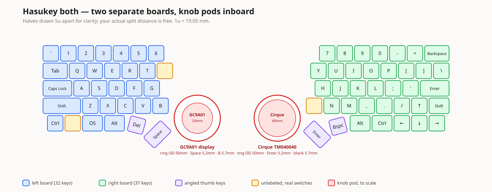

# Dyad

A split keyboard with a rotary encoder ring on each half — a round display
inside the left ring, a circular trackpad inside the right. Custom PCBs in
KiCad, a 3D-printed case, running QMK.

*Dyad: a pair. Two halves, two dials, two boards.*



69 keys, 32 left and 37 right, row-staggered. Bare RP2040 on each side.

---

## The idea that makes it work

"A display on top of a knob" normally means the display rotates, which needs a
slip ring or a wire loom that survives unlimited rotation.

Dyad inverts it. **The display and trackpad are static; the ring rotates around
them.** A fixed centre post rises through the bearing bore and cantilevers the
sensor above the moving parts, so no wire ever moves. Visually and
ergonomically it reads as a knob with a screen on top — electrically it's a
static part with a ring turning beneath it.

Both rings are 50 mm outside diameter, so the halves are a matched pair.

## Hardware

| | |
|---|---|
| MCU | Bare RP2040, one **shared controller module** used by both halves |
| Left pod | GC9A01 1.28" round LCD, 240×240, SPI |
| Right pod | Cirque Pinnacle TM040040, 40 mm |
| Encoders | EC11, driven by a ring gear from the rotating ring |
| Switches | MX hot-swap, Kailh sockets |
| Per-key RGB | SK6812MINI-E — footprints fitted, populated only if wanted |
| Split link | USB-C to USB-C, half-duplex serial |

Four board designs: one controller module (the only board needing an assembly
service), two asymmetric main PCBs, and two knob-module variants.

## Status

| Phase | State |
|---|---|
| 0 — Layout | **Done.** Validated against printed 1:1 mock-ups. |
| 1 — Bench bring-up | **Partial.** Toolchain, flashing, encoder and Cirque all pass. Display, ribbon-SPI, split and current tests await parts. |
| 2 — Knob mechanism | Not started. |
| 3 — KiCad | Main PCBs generated and placed; controller pin assignment and BOM settled. |
| 4 — Case | Not started. Board outlines and plate cutouts exported for it. |

The main PCBs are a **placement scaffold**, not a finished layout. DRC reports
223 violations on the left and 260 on the right, of which **0 and 1** are
electrical (shorts, clearance, mask bridges) — the rest is silkscreen overlap
and library-configuration noise. Routing is incomplete, notably the angled
thumb keys.

## Repository

```
docs/          PLAN.md, WORKFLOW.md, CONTROLLER.md, PHASE1.md, TOOLS.md
               plus printable 1:1 mock-ups
hardware/
  interface.yaml   the contract between the PCB and case designs
  layout/          KLE source of truth, parser, pod-placement solver
  pcb-main-*/      the two main PCBs (generated)
  pcb-controller/  controller module, and the vendored RP2040 reference
  outlines/        board outlines, plate cutouts and STEP, for the case
firmware/      QMK external userspace
```

Nearly everything under `hardware/` is **generated** from the KLE layout.
Regenerate with `hardware/generate_main_pcbs.py`, `export_outlines.py` and
`export_plate.py` — see `docs/TOOLS.md` for the environment they need.

## Building the firmware

```bash
qmk config user.qmk_home=~/qmk_firmware
qmk config user.overlay_dir=$PWD/firmware
ln -sfn $PWD/firmware/keyboards/dyad ~/qmk_firmware/keyboards/dyad
qmk compile -kb dyad/split -km default
```

The symlink is required: QMK's external userspace holds keymaps and build
targets, but **not keyboards**.

`dyad/proto` and `dyad/split` are Phase 1 bring-up targets for dev boards, not
the shipping keyboard definition.

## Documentation

- **[PLAN.md](docs/PLAN.md)** — the full design, decisions and rationale
- **[WORKFLOW.md](docs/WORKFLOW.md)** — how the case and PCBs are co-designed
  without deadlocking
- **[CONTROLLER.md](docs/CONTROLLER.md)** — controller pin assignment, BOM and
  build steps
- **[PHASE1.md](docs/PHASE1.md)** — bench bring-up, with results
- **[TOOLS.md](docs/TOOLS.md)** — toolchain, and the traps found in it

## Licence

MIT — see [LICENSE](LICENSE).

`hardware/pcb-controller/upstream/` vendors
[RP2040-designguide](https://github.com/calliah333/RP2040-designguide)
(MIT, © 2021 Sleepdealer) as a read-only reference. The key layout originates
from the *Hasukey* KLE layout.
